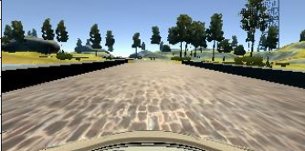
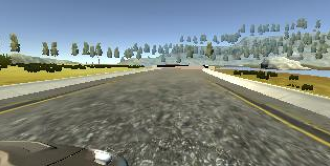
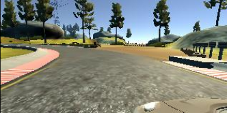
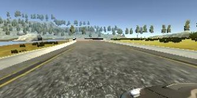
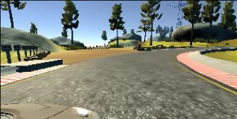
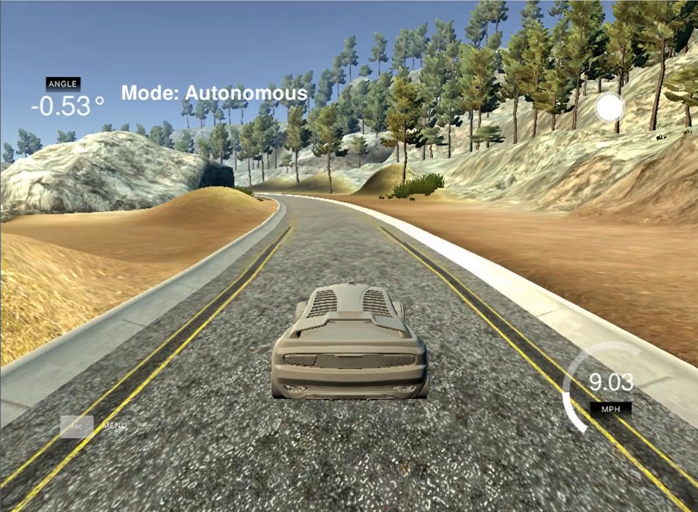

# End-to-End-Learning-for-Self-Driving-Cars

# **Behavioral Cloning** 

**Behavioral Cloning Project**

The goals / steps of this project are the following:
* Use the simulator to collect data of good driving behavior
* Build, a convolution neural network in Keras that predicts steering angles from images
* Train and validate the model with a training and validation set
* Test that the model successfully drives around track one without leaving the road

### Files Submitted & Code Quality

#### 1. Submission includes all required files and can be used to run the simulator in autonomous mode

My project includes the following files:
* End-to-End Learning.py containing the script to create and train the model
* drive.py for driving the car in autonomous mode
* model.h5 containing a trained convolution neural network 

#### 2. Submission code is usable and readable

The End-to-End Learning.py file contains the code for training and saving the convolution neural network. The file shows the pipeline I used for training and validating the model, and it contains comments to explain how the code works.

### Model Architecture and Training Strategy

#### 1. An appropriate model architecture has been employed

My model consists of a convolution neural network with 3x3 filter sizes and depths between 32 and 128.

The model includes RELU layers to introduce nonlinearity, and the data is normalized in the model using a Keras lambda layer. 

#### 2. Attempts to reduce overfitting in the model

The model contains dropout layers in order to reduce overfitting. 

It was trained and validated on different data sets to ensure that the model was not overfitting. It was tested by running it through the simulator and ensuring that the vehicle could stay on the track.

#### 3. Model parameter tuning

It used an adam optimizer, so the learning rate was not tuned manually.

#### 4. Appropriate training data

Training data was chosen to keep the vehicle driving on the road. I used a combination of center lane driving, recovering from the left and right sides of the road. 

For details about how I created the training data, see the next section. 

### Model Architecture and Training Strategy

#### 1. Solution Design Approach

The overall strategy for deriving a model architecture was to increase the accuracy and reduce  validation loss. My first step was to use a convolution neural network model similar to the Nvidia model. I thought this model might be a good starting point for creating the keras model. In order to gauge how well the model was working, I split my image and steering angle data into a training and validation set. I found that my first model had a low mean squared error on the training set but a high mean squared error on the validation set. This implied that the model was overfitting. 
To combat the overfitting, I modified the model by introducing Droupouts.
Then 3 Dense layers were implemented. 
The final step was to run the simulator to see how well the car was driving around track. There were a few spots where the vehicle fell off the track mainly before the bridge and also at the end during the shart turns. To improve the driving behavior in these cases, I increased the training data by increasing the lap.

At the end of the process, the vehicle is able to drive autonomously around the track without leaving the road.

#### 2. Final Model Architecture

The final model architecture consisted of a convolution neural network with the following layers and layer sizes. Here is a visualization of the architecture,

| Layer         		            |     Description	        					            | 
|:-----------------------------:|:---------------------------------------------:| 
| Input         		            | 160x320x3 RBG image   				          	    | 
| Lambda Layer(Normalization)   | 160x320x3 Input shape 	                      |
| Cropping Layer                | (72, 25) from top and bottom 	                |
| Convolution Layers            | (3, 3), 32 filter 	                          |
| Maxpooling					          |	(2, 2)										                    |
| Dropuout	                    | 0.5 			        	                          |
| RELU	                        | 1x1 stride, valid padding, outputs 10x10x32	  |
| Fully connected		            | Neurons 128        		 				              	|
| RELU					                |												                        |
| Fully connected		            | Neurons 84  								                 	|
| RELU					                |											                        	|
| Fully connected		            | Neurons 1         							              |

#### 3. Creation of the Training Set & Training Process

To capture good driving behavior, I first recorded two laps on track one using center lane driving. Here is an example image of center lane driving:

##### Original Image of road from front camera 

I then recorded the vehicle road images from left and right camera fixed on the vehicle, so that the vehicle would learn to reposition itself to the centre. These images show what a recovery looks like :

##### Original Image of road from right camera

##### Original Image of road from left camera

To augment the data set, I also flipped images and steering angles accordingly so to increase the data set and in turn the accuracy of the model. For example, here is an image that has then been flipped:

##### Flipped Image of road from right camera

##### Flipped Image of road from left camera

After the collection process, I had 48216 number of data points. I then preprocessed this data by applying normalization to all the images. Later I trimmed the images from top and bottom by distance of 75 and 25 pixels respectively. As in the top portion of the image the sky and far away trees were seen which were not important in driving the vehicle. And for the bottom part the car front bonet was seen which is a useless information for training the model.   

I finally randomly shuffled the data set and put 20% of the data into a validation set. 

I used this training data for training the model. The validation set helped determine if the model was over or under fitting. The ideal number of epochs was 5 as evident by the results of validation. I used an adam optimizer so that manually tuning the learning rate wasn't necessary.

#### 6. Result 
#### (Click the below thumbnail for complete video)
 

